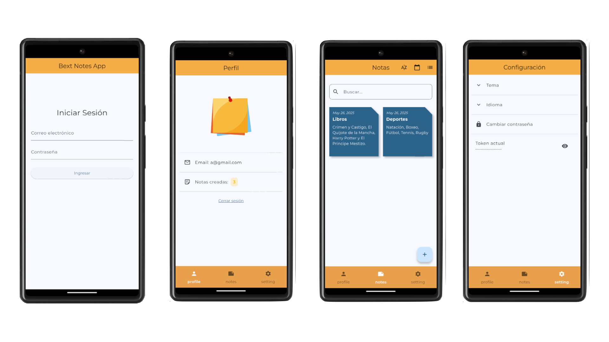

# 📝 Bext Notes

Una aplicación de **notas offline** desarrollada en Flutter, con autenticación simulada, persistencia local usando SQLite y arquitectura limpia. Ideal para mantener tus ideas organizadas incluso sin conexión a internet.

---

## 🚀 Características

- 🔐 Autenticación simulada con token local
- 🗂️ CRUD de notas totalmente offline
- 🧱 Arquitectura limpia (Clean Architecture)
- 🧠 Gestión de estado con **BLoC**
- 🌙 Cambio dinámico de tema (claro/oscuro)
- 🌐 Selector de idioma (EN/ES)
- 💾 Persistencia con SQLite y SharedPreferences
- 🎨 Interfaz creativa con diseño tipo sticky notes

---

## 📱 Capturas de pantalla
  
---

## 🛠️ Tecnologías y librerías usadas

- [Flutter](https://flutter.dev/)
- [BLoC](https://pub.dev/packages/flutter_bloc)
- [go_router](https://pub.dev/packages/go_router)
- [SQLite (sqflite)](https://pub.dev/packages/sqflite)
- [Shared Preferences](https://pub.dev/packages/shared_preferences)
- [ScreenUtil](https://pub.dev/packages/flutter_screenutil)
- [intl](https://pub.dev/packages/intl)
- [Google Fonts (Montserrat)](https://fonts.google.com/specimen/Montserrat)

---

## 📦 Estructura del proyecto

```bash
lib/
├── core/
│   ├── router/               # Configuración global de rutas (go_router)
│   ├── theme/                # Temas y estilos globales (Material3)
│   ├── extensions/           # Extensiones útiles para temas y widgets
│   └── utils/                # Utilidades generales (opcional)
│
├── features/
│   ├── auth/                 # Módulo de Autenticación
│   │   ├── data/             # Implementaciones (repositorios, datasources)
│   │   ├── domain/           # Abstracciones y contratos (interfaces)
│   │   ├── presentation/     # UI: pantallas y widgets
│   │   └── bloc/             # Bloc/Auth: lógica de negocio
│
│   ├── notes/                # Módulo de Notas
│   │   ├── data/             # Datasource local (SQLite) y repositorio
│   │   ├── domain/           # Entidades y contratos
│   │   ├── presentation/     # Pantallas y widgets para notas
│   │   └── bloc/             # Bloc para manejo de notas
│
│   └── setting/              # Módulo de Configuración
│       ├── presentation/     # UI: página de ajustes
│       └── cubit/            # Cubit para estado de configuración
│
├── home_screen.dart          # Pantalla principal luego del login
└── main.dart                 # Punto de entrada de la aplicación


---

## 🔐 Login Simulado

El login funciona con cualquier combinación de correo y contraseña. Se genera un token aleatorio que se guarda en SharedPreferences para simular una sesión activa.

---

## ⚙️ Configuración de entorno

1. Clona el repositorio:

```bash
git clone https://github.com/tu_usuario/bext_notes.git
cd bext_notes

📌 Por hacer
 Sincronización en la nube

 Notificaciones locales

 Autenticación real con Firebase

🙌 Autor
Desarrollado por [Tu Nombre]
GitHub – LinkedIn

📄 Licencia
Este proyecto está licenciado bajo la MIT License.
Consulta el archivo LICENSE para más información.